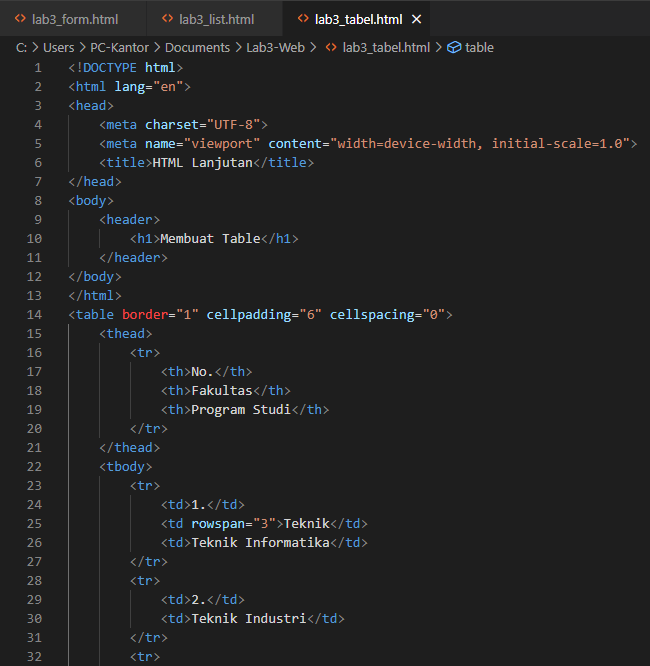

# Lab3-Web

Nama : M. Aqil Al Farid 
NIM : 312010140 
Kelas : TI.20.B.1 

# Tugas
Tugas Pemrograman Web Lab3Web 
 

# HTML LIST

Kali ini kita akan membuat bagaimana cara membuat HTML List. Saya akan Share kepada kalian codingan beserta hasilnya.

 
 

Setelah kita lakukan codingan seperti diatas , kita akan melihat hasilnya :

 

# HTML TABEL

Selanjutnya , kita akan membuat HTML Tabel. Berikut Codingannya

 
 

Berikut hasil codingannya :

 

# HTML Form

Last pada pertemuan kali ini , saya akan membagian hasil codingan HTML Form 

 
 

Dan seperti biasa kita akan melihat hasilnya :

 

Sekian dari saya , kita lanjut di seksi pertemuan berikutnya. Terima kasih
